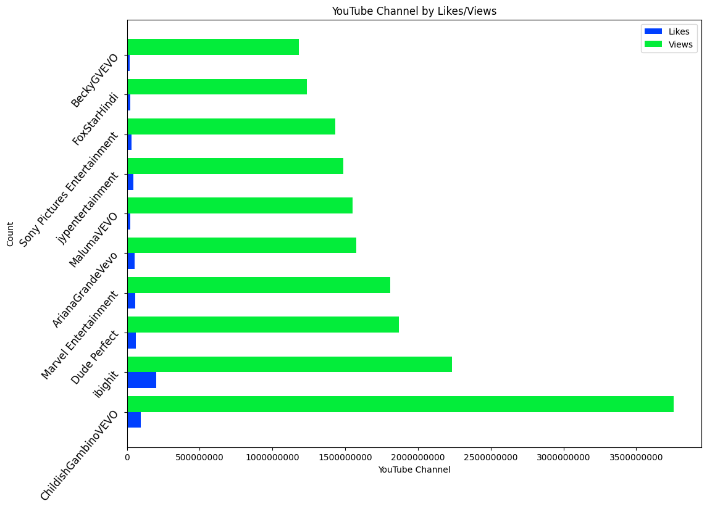
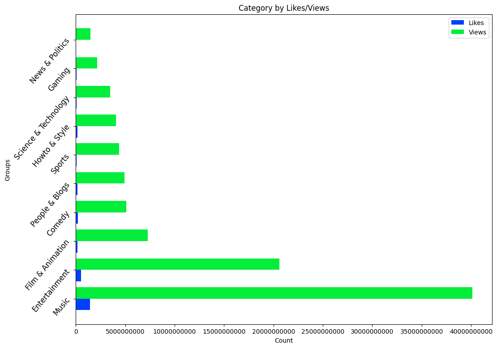
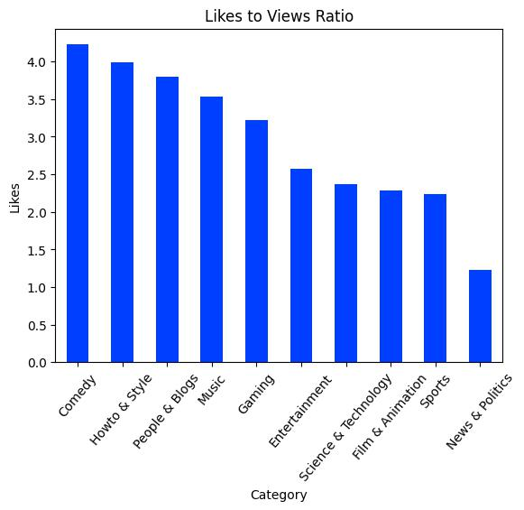
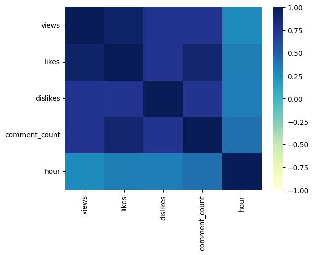

# YouTube Casestudy Overview

Team Project Analyzing Trending Youtube Content in 2017. This analysis seeks to provide insight of the YouTube content in the US.

## Table of Contents 
1. [Data](#data)
2. [Exploratory Data Analysis](#exploratory-data-analysis)
    * [YouTube Channel by Likes & Views](#youtube-channel-by-likes--views)
    * [Category by Likes & Views](#category-by-likes--views)
    * [Likes to Views Ratio](#likes-to-views-ratio)
    * [Relationship Between User Engagements](#relationship-between-user-engagements)
3. [Moving Forward & Requirements](#moving-forward--requirements)

# Data
The following Data was extracted from [Kaggle.com](https://www.kaggle.com/datasets/datasnaek/youtube-new) which includes a range of information from user engagement, video information, and trending dates. The team imported and cleaned the data using `pandas` and produced four visualizations based off our goals:

- Identify top 10 YouTuber's by most likes and views.

- Identify top 10 YouTube Category by likes and views.

- Identify the likes to views ratio in a percentage.

- Identify the correlation between user engagements.

## Exploratory Data Analysis

### YouTube Channel by Views & Likes

The team started by first identify the Top 10 YouTubers by views and likes.

The team then graphed the results which showcase the amount of likes and views. With our findings, it is clearly visible that with the amount of views, users typically do not engage with the video. We found only 3% of users engage with the content via likes.

### Category By Likes & Views

In order to achieve our goal, the team began by identifying which category is in relation to YouTube's ID Number. See chart below for Top 10 categories by likes and views:

|    Top 10 Categories |      Likes |       Views |
|---------------------:|-----------:|------------:|
|                Music | 1416838584 | 40132892190 |
|        Entertainment |  530516491 | 20604388195 |
|     Film & Animation |  165997476 |  7284156721 |
|               Comedy |  216346746 |  5117426208 |
|       People & Blogs |  186615999 |  4917191726 |
|               Sports |   98621211 |  4404456673 |
|        Howto & Style |  162880075 |  4078545064 |
| Science & Technology |   82532638 |  3487756816 |
|               Gaming |   69038284 |  2141218625 |
|      News & Politics |   18151033 |  1473765704 |

Top performers on the YouTube trending list are music videos (such as the famously virile “Gangam Style”), celebrity and/or reality TV performances, and the random dude-with-a-camera viral videos that YouTube is well-known for.

### Likes To Views Ratio

The team was curious on how the percent of users that liked the video in comparison to viewing the video. The graph states that even though Music videos are the most popular on Youtube via ‘views’, Comedy videos have the highest percentage of ‘likes’ to ‘views’.

### Relationship Between User Engagements

The team created a Correlation graph based on the following inputs: views, likes, dislikes, the hours, and the amount of comments.
The darker areas reflect a positve correlation, while the lighter areas have a negative correlation. 

## Moving Forward & Recommendations

### Moving Forward

This casestudy was conducted over the span of two days. There is an abundance of information to be further analyzed. For example, with our findings that Comeday has a higher engagement, we could further analyze why that exactly is. We could also gleem insight on the time-line videos posted versus the time-line of videos trending. This information would allow us to identify channels that had an influx of views in a short period of time.

### Reccomendations

Based off current analysis, content should be promoted on Music, Entertainment, and Comedy categorized YouTube videos. Look for opportunities to partner with entities from the Top Influencer Lists. However, insight as to a company or individuals target audience or content they are trying to market would dictate which channels and categories they should use.